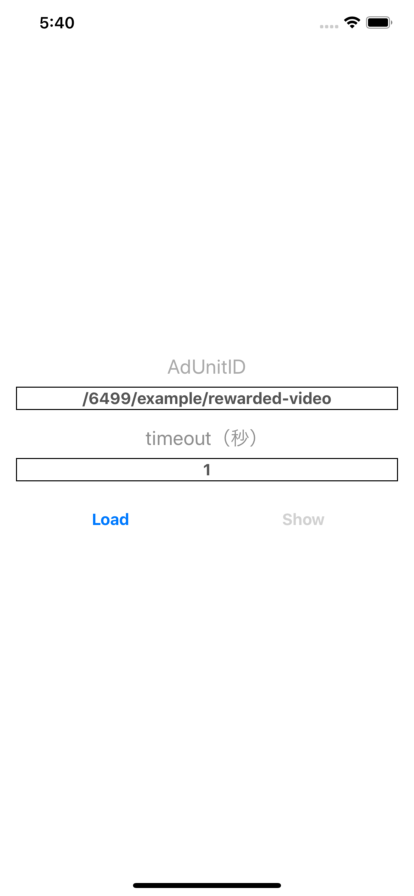

# Google Ad Manager timeout対応



現状はGoogle Ad Managerで用意されているテスト用のIDを使用しています。

[ドキュメント](https://developers.google.com/ad-manager/mobile-ads-sdk/ios/rewarded-video?hl=ja)

## 環境

```sh
Xcode: 10.1
Swift: 4.2
minimum iOS: 9.0
```

## 環境構築

```sh
> bundle install --path=vendor/bundle
Fetching gem metadata from https://rubygems.org/..........
Resolving dependencies...
~ ログ ~
Bundle complete! 1 Gemfile dependency, 30 gems now installed.
Bundled gems are installed into `./vendor/bundle`
```

```sh
> bundle exec pod install --repo-update
Updating local specs repositories
~ pod repo update ログ ~
Analyzing dependencies
Downloading dependencies
~ install ログ ~
Generating Pods project
Integrating client project

[!] Please close any current Xcode sessions and use `AdX.xcworkspace` for this project from now on.
Sending stats
Pod installation complete! There is 1 dependency from the Podfile and 4 total pods installed.
```

```sh
> open AdX.xcworkspace
```
